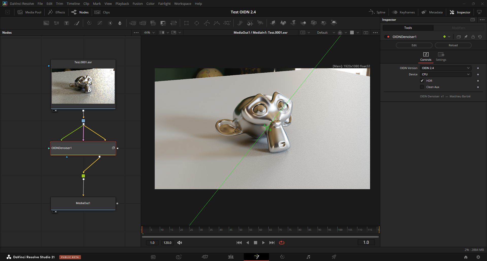

# OIDN Denoiser — DaVinci Resolve Fusion

A DaVinci Resolve / Fusion fuse that brings [Intel Open Image Denoise (OIDN) 2.4](https://www.openimagedenoise.org/) directly into your node graph. Denoise ray-traced renders with CPU or GPU, with full support for albedo and normal auxiliary passes.

**v1.0 — Written by Matthieu Barbié**
---

---

## Features

- **CPU by default** — stable on any system, no driver dependency at project open
- **Optional GPU acceleration** — CUDA (Nvidia), HIP (AMD), SYCL (Intel)
- **Multi-version support** — install multiple OIDN versions side by side; the tool auto-detects them from folder naming (`OIDN_X.X_win/`)
- **Quality modes** — Default, Fast, Balanced, High (OIDN 2.3+)
- **Auxiliary passes** — Albedo and Normal inputs for improved denoising quality
- **HDR** — on by default, suitable for linear light render outputs
- **Clean Aux** — for pre-denoised auxiliary passes
- **Multi-layer EXR support** — connect a single multi-layer EXR to all inputs and use the node's Layer remapping in Settings (no Swizzle nodes needed)
- **OIDN 3.0 ready** — temporal denoising inputs (Previous Frame, Motion Vectors) are scaffolded and will activate automatically when an `OIDN_3.0_win/` folder is detected

---

## Requirements

- DaVinci Resolve Studio 18+ (Fusion page)
- Windows 10/11 x64
- Input images must be **16-bit or 32-bit float** (EXR). 8-bit inputs produce a red error frame.

> macOS and Linux folder structures (`OIDN_X.X_mac/`, `OIDN_X.X_lin/`) are supported in the code but binaries are not included in this release. Download them from the [OIDN releases page](https://github.com/RenderKit/oidn/releases) and follow the same folder structure.

---

## Installation

### 1. Download

Download the latest release zip from the [Releases](https://github.com/MattRM2/OIDNFusion/releases) page and extract it.

### 2. Locate your Fuses folder

| OS | Path |
|----|------|
| Windows | `%APPDATA%\Blackmagic Design\DaVinci Resolve\Support\Fusion\Fuses\` |
| macOS | `~/Library/Application Support/Blackmagic Design/DaVinci Resolve/Fusion/Fuses/` |

> You can also use a local `Fuses/` folder inside your project, or place the files in the shared Fusion fuses path.

### 3. Copy files

Copy the following into your Fuses folder, **keeping the folder structure intact**:

```
Fuses/
  OIDN_Fusion.fuse
  OIDN_2.4_win/
    OpenImageDenoise.dll
    OpenImageDenoise_core.dll
    OpenImageDenoise_device_cpu.dll
    OpenImageDenoise_device_cuda.dll
    OpenImageDenoise_device_hip.dll
    OpenImageDenoise_device_sycl.dll
    sycl8.dll
    tbb12.dll
    tbbbind.dll
    tbbbind_2_0.dll
    tbbbind_2_5.dll
    ur_adapter_level_zero.dll
    ur_loader.dll
    ur_win_proxy_loader.dll
    LICENSE
```

> The `.fuse` file and the `OIDN_2.4_win/` folder **must be in the same directory**.

### 4. Restart DaVinci Resolve

The tool appears under **Color > OIDN Denoiser** in the Fusion Effects library.

---

## Usage

### Basic — Color only

Connect your beauty render to the **Color** input. CPU denoising runs with no other setup required.

```
[MediaIn / EXR Loader] ──► [OIDN Denoiser] ──► [MediaOut]
```

### With auxiliary passes (recommended)

Connect albedo and normal passes to improve denoising quality and preserve surface detail.

```
[EXR Loader] ──► Color  ─┐
[EXR Loader] ──► Albedo ─┤ [OIDN Denoiser] ──► [MediaOut]
[EXR Loader] ──► Normal ─┘
```

### Multi-layer EXR — single loader (cleanest setup)

If your EXR contains all passes in one file, connect the **same loader to all three inputs**, then configure the **Settings > Layers** panel on the OIDN node:

| Setting | Value (example — Blender/Cycles) |
|---------|----------------------------------|
| Color Layer | `View Layer.Combined` |
| Albedo Layer | `View Layer.Denoising Albedo` |
| Normal Layer | `View Layer.Denoising Normal` |

DaVinci Resolve extracts and routes each layer before passing it to the tool — no Swizzle nodes needed.

---

## Parameters

| Parameter | Description |
|-----------|-------------|
| **OIDN Version** | Selects which installed OIDN version to use. Auto-detected from `OIDN_X.X_win/` folders. |
| **Device** | CPU (default), CUDA (Nvidia), HIP (AMD), SYCL (Intel). GPU DLLs are loaded on first render only — not at project open. |
| **Quality** | Default · Fast · Balanced · High. Fast is used automatically during interactive previews. |
| **HDR** | Keep enabled for linear light render outputs (EXR). |
| **Clean Aux** | Enable if your albedo/normal passes are already noise-free. |

---

## Notes on GPU

GPU mode is disabled by default. Multi-GPU setups and certain driver configurations can cause instability. GPU DLLs are loaded **only when you trigger a render** with a GPU device selected — not at project open — so your composition opens safely regardless of the saved device setting.

If GPU causes issues, switch back to CPU. OIDN's CPU performance (multi-threaded via Intel TBB) is very competitive for typical render resolutions.

---

## Adding a second OIDN version

To install OIDN 3.0 alongside 2.4 when it releases:

1. Download the OIDN 3.0 Windows package from [github.com/RenderKit/oidn/releases](https://github.com/RenderKit/oidn/releases)
2. Create a folder named `OIDN_3.0_win/` next to the fuse
3. Copy the DLLs into it
4. Restart DaVinci Resolve — the new version appears in the **OIDN Version** dropdown

OIDN 3.0 will also unlock the **Temporal Denoising** inputs (Previous Frame, Motion Vectors) for flicker-free animation denoising.

---

## License

- **OIDN_Fusion.fuse** — © 2026 Matthieu Barbié, BSD 2-Clause License
- **OIDN_2.4_win/** binaries — © Intel Corporation, Apache License 2.0 (see `OIDN_2.4_win/LICENSE`)
